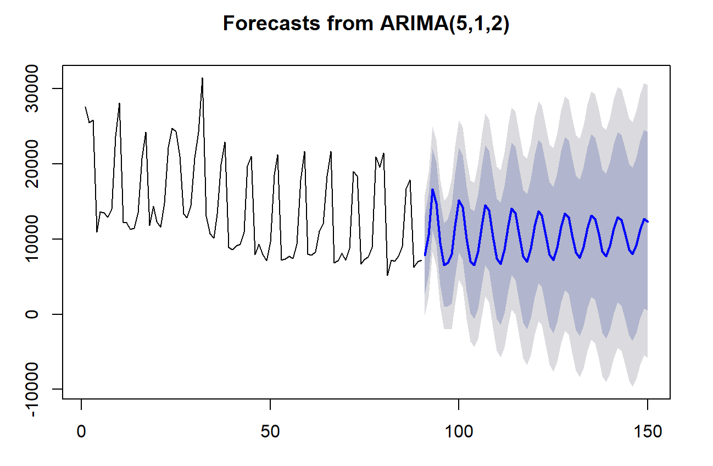
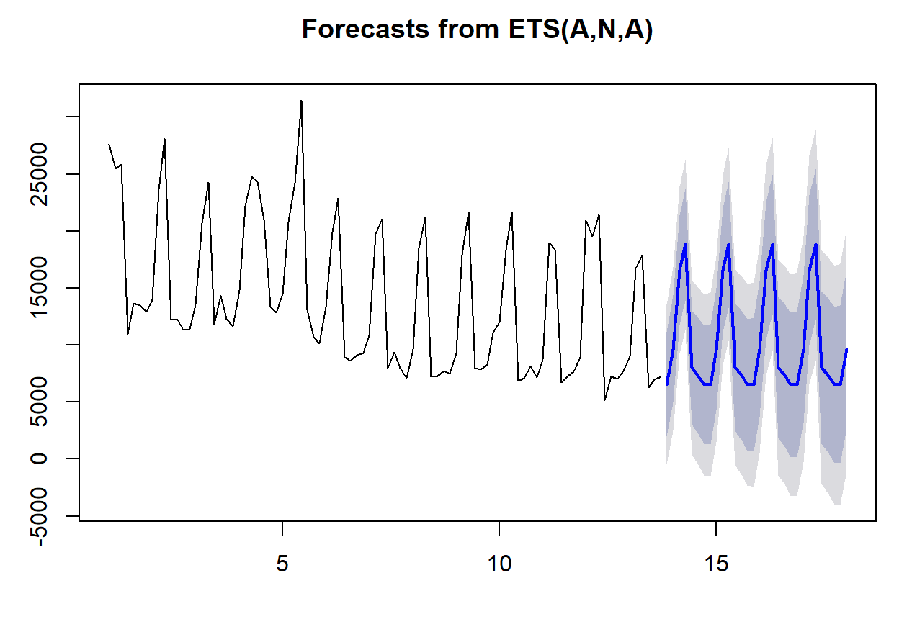
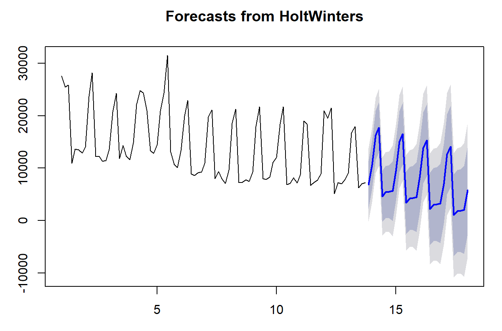
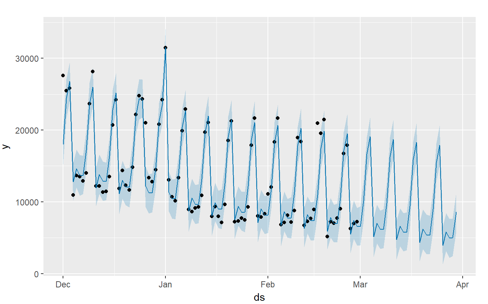
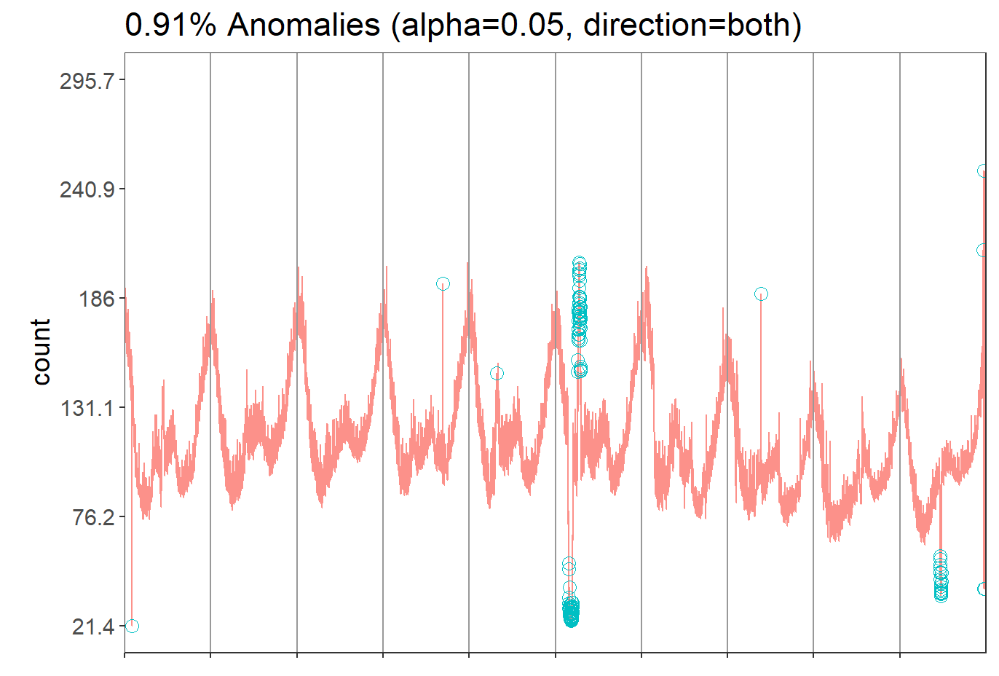

# Improving Time Series Forecasting

This was a collaboration project with [Anggia](https://www.linkedin.com/in/anggia97/)  
at [Algoritma Data Science School](https://algorit.ma).
This project introduce `AnomalyDetection` package from Twitter as our primary tool for detecting anomaly and `prophet` package from Facebook
for time-series forecasting. The dataset is a food and beverage 3-months transaction data (~800 MB).  

The highlights are as follows:
-   `AnomalyDetection` package employs an algorithm referred to as Seasonal Hybrid ESD (S-H-ESD), which is an improvement of 
    the well known S-ESD (Seasonal ESD) method. This enables us to find anomalies in our time-series data that is hidden by seasonal activity,
    by replacing Mean and Standard Deviation with more robust statistical measures (such as Median and MAD, in this case).
-   `prophet` package implements some improvement in creating time-series model by allowing us to neglect/reduce the 'effect' of some data points 
    (that we specify by ourselves) that may reduce the performance of the time-series model. For instance, we may put New Year Day (January 1st) and 
    Christmas Day (December 25th) as those selected data points, since we know that there would be a massive abnormal transaction only at those days 
    that are strong enough to weaken our time-series model. The other useful feature is that, we can still build a time series model eventhough 
    there are several missing values within our time-series data (which will cause problems in a normal case), by specifying in the algorithm those 
    time stamps where the data is missing.
    
So, in this project, we implement both packages to boost the performance of our time-series model more further. 
First, we extract all anomaly data points by using the algorithm in `AnomalyDetection` package. 
Then, we plug every anomaly data points that we got as data points that will be 'treated' by the algorithm in `prophet`, creating a significantly 
better result compared to the usual ARIMA, Holt-Winters, and ETS models.

## Some Results of Common Time-Series Models 

### ARIMA (Auto-Regressive Integrated Moving-Average) Model

### ETS Model

### Holt-Winters Model

## Our Result

### Using `prophet` directly

By using `prophet` with specifying well-known holiday as 'outlier' data, we get the following result

This gives us better result compared to models in the previous section. 
But, we can make it even better by implementing algorithm from `AnomalyDetection` to find 'outlier' data instead of inputting it manually.

### Combination of `AnomalyDetection` and `prophet`

Implementing the algorithm from `AnomalyDetection`, we get the following outliers. 

Then, by specifying those data points as 'outlier' points in `prophet`, we get a better result with significantly narrower prediction interval (**right**) compared to the result only from `prophet` (**left**).

 

For the detail, check [here](https://github.com/Steven-Surya/anomaly-prophet/blob/main/prophet_AnomalyDetection.html). 
